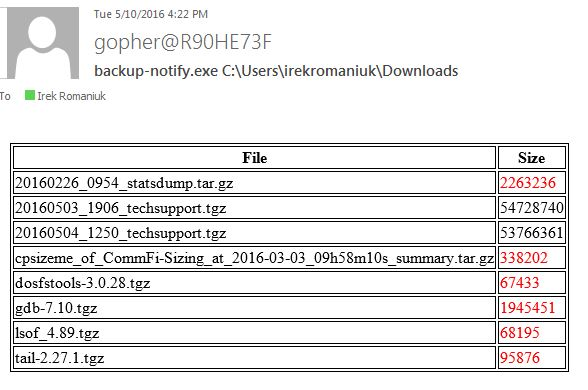

### Backup Notify
List files with given name pattern and directory path to verify that size is greater than minimum, then send notification by email (using 'relay')

```
$ backup-notify -h
Copyright 2016 @IrekRomaniuk. All rights reserved.
Usage of backup-notify:
  -email string
        Whom to notify
  -name string
        File name or part of it (default "mdsbk.tgz")
  -path string
        Directory to look for files (default ".")
  -size int
        Minimum file size (default 9000000)
  -v    Prints current version
$ backup-notify -v
App Version: 1.0.3
Build Time : 2016-05-10_08:28:53PM
```
	
